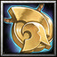

#  AnoMech

*Another FFXIV mechanics simulator*

---
 
Simulate FFXIV raid mechanics client-side for solo practice. Go to any Inn, open the plugin with `/anomech` and start practicing!

**WARNING!!!**

* This plugin is in beta and is unstable. You won't crash during your training sessions, but you will crash
after it. If you are doing any serious content: **RESTART YOUR GAME AFTER USING PLUGIN**.  
You **WILL CRASH** in the middle of pull.  
You don't have to disable plugin, just don't use it. I'm working on stability improvements, but it's not trivial.

* **You are cut off from server traffic while in the sim zone.** To keep the
fake zone stable, the plugin firewalls incoming packets from the server.
While simulating:
  * Players joining or leaving your party will not appear in the party list
  until you leave the sim zone.
  * Ready checks will not pop — no toast, no sound, no flash.
 

## Installation

See: https://github.com/anomek/MyDalamudPlugins

## How to help
1. Please provide feedback and report any issues in scenarios: bad timing, damage, config not working at it supposed
2. Bot AI currently only covers strategies from my region. Adding strategies for other regions requires little coding.
   Feel free to create pull request.
3. Adding new scenario is more involved. `tools/parser.py` generates a baseline scenario from a log, which still 
   needs randomization, mechanic-failure logic and bot AI added by hand.
4. Plugin-development or reverse-engineering help, and improvement ideas, are also welcome.

## Details

* Spawns fake party members and boss NPCs into the live game client
* Drives their positions, cast bars, tethers, and VFX so mechanics play out visually
* Supports client-side zone loading — practice inside the instance without a full party

Currently implemented:
 - The Omega Protocol (Ultimate) — P5 Delta
 - The Omega Protocol (Ultimate) — P5 Sigma
 - The Omega Protocol (Ultimate) — P5 Omega

## Known issues
* Crashes ;(
* Sprint doesn't work
* In scenarios for Top Omega Protocol (Ultimate):
  * Tether distance threshold are very rough estimations

## Acknowledgments

AnoMech leans heavily on the work of other Dalamud plugins. Huge thanks to their authors!

Without them, the following would not be possible:

* **Hyperborea** — solo duty arena loading.
* **FFXIV-RaidsRewritten** — stunning the player on death and playing raid VFX.
* **bossmod** — mechanics timings and positions.
